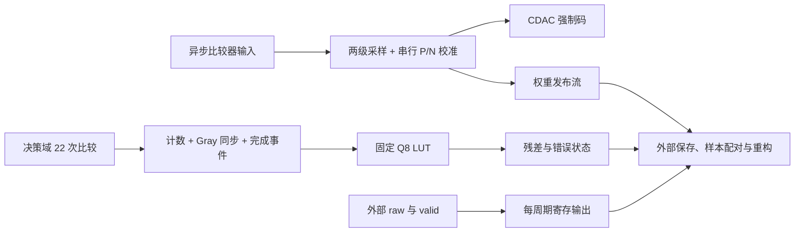

# 原理、RTL 功能与映射电路复核

日期：2026-10-02。对象是 v5.1 的四份原始 RTL（共 1966 行）、历史 testbench、DC/PNR 报告、交付网表和 LEF；论文为 Huang et al., IEEE JSSC 60(3), 813–825，2025，[DOI](https://doi.org/10.1109/JSSC.2025.3526595)。再次核对原文 III-A/C/D/E、Fig. 6、Table I 和 IV 的校准测量条件。**本轮确认了功能数据流，并复现了之前未覆盖的错误恢复和定点边界；原 RTL 未修改。** 商业 EDA 和完整模拟转换链没有重跑，因此本报告不能保证硅上精度、PPA 或签核。

详细阅读入口：

- [校准器：逐状态、P/N 极性、保护位、平均与量化、定点范围](rtl_review_20261002/calibration_analysis.md)
- [SRM 与 LUT：统计原理、双域协议、Gray 捕获、超时、格式参数](rtl_review_20261002/srm_analysis.md)
- [综合电路：层级/寄存器账、门控/reset、关键路径和结构优化估算](rtl_review_20261002/synthesis_analysis.md)
- [实验日志](rtl_review_20261002/review_run.log)、[实验解析](rtl_review_20261002/review_result.json)、[精确统计计算](rtl_review_20261002/principle_numbers.json)、[映射资源库存](rtl_review_20261002/synthesis_inventory.json)

## 1. 论文原理与当前实现的对应关系

论文完整信号链是分体采样 SS → auto-zero AZ → flash/SAR 转换 → 固定 DAC 码下 SRM → 权重重构并扣除残差。SS 将约 20 pF 的低噪声采样电容与约 1 pF 的低驱动负担 CDAC 分开；AZ 对采样噪声差进行补偿。它们依赖开关、放大器和时序，数字计数器本身不能实现这些收益。

Fig. 6 的阵列含分段桥接电容和冗余，20 个物理权重不等于普通 20 位二进制 DAC。两位 flash 和其余异步 SAR 位循环也在完整架构中。现有四文件核心提供校准、SRM 和 raw 寄存输出；没有 SS/AZ/flash 开关控制、常规转换 SAR sequencer 或完整重构器。原文件头援引旧学位论文与目录缺失推断“论文必然片外重构”，不足以证明该物理放置；片外重构是**本仓库当前选择的划分**。

| 论文环节 | 原理/验收条件 | 当前 RTL 对应 |
|---|---|---|
| SS/AZ | 电容比、噪声相关、增益、充电注入及模拟保持 | 无模拟模型和完整时序实现，不能由本块验收 |
| SAR 转换 | 非二进制 CDAC、redundancy、flash、异步比较与 settling | raw 由外部提供；校准 SAR 搜索只用于测权重 |
| SRM | DAC 保持不变，额外 22 次比较，每次约 3 ns，约 70 ns 保持窗口 | `dec_clk` 计数与 `clk` LUT 发布；独立正常请求实验通过 |
| 校准 | 6 个 LSB 参考测 14 个 MSB；SS 和 SRM 在校准期间启用 | P/N 搜索、shadow 求和和平均存在，但没有 SRM 残差输入 |
| 输出修正 | 使用已校准物理权重重构，再按相同尺度扣除残差 | 输出权重流、raw 和 residue；没有样本标签/配对与最终计算 |

III-E/IV 所述 64 次 averaging 达到约 94 dB mean SNDR 的校准结果，使用校准权重重构 **1 kHz 满幅、1 MS/s** 输入。不能将它直接视为本 RTL 32 个 P/N 对的精度保证，也不能当作全频 5 MS/s 的指标。论文 93.7 dB 最佳 SNDR 来自完整 ADC；达到它仍取决于上述模拟环节和重构。

SRM 的二值判决在正极性模型下有 `P(1)=Φ((r+b)/σ_actual)`，`r_hat=σ_LUT Φ⁻¹(P_hat)`，最终应扣除这个同坐标的残差估计。代码符号与该模型可对应，但真实开关/比较器反相、前置增益、DAC LSB 与输出 LSB 的换算仍需电路接口证明。论文 preamp IRN 59.1 µVrms / DAC LSB 80 µV 仅在相同噪声坐标下给出约 0.739 LSB；不能直接覆盖当前默认 0.5。AZ、有限带宽与决策相关性必须进入模型，不能把 22 次比较自动解释为 22 个独立噪声样本。

## 2. 当前四模块功能与电路估算



图中的外部重构未包含在当前核心；SRM 也没有反馈到校准器。顶层 raw 每周期更新，只在 valid 时接受它并不自动保证后续 residue 配对。

| 模块 | 实际数据通路 | 交付 PNR 映射 |
|---|---|---|
| 校准器 | 13 状态 FSM、20 位试探码、等待/索引计数、20×30 shadow DFF、动态读 mux、串行求和、保护补偿、三操作数平均累加、快照/发布 | 3170 cells、904 DFF、35 门控 latch，90777.456 µm²（88.736%） |
| SRM（含 LUT） | 两个 5 位决策 counter、toggle 握手、Gray 同步/解码、6 状态 FSM、7 位 watchdog、计数捕获和 LUT 输出 | 283 cells、86 DFF、5 门控 latch，8216.208 µm²（8.031%） |
| 顶层直接实例 | raw/valid 的 21 DFF，以及 I/O/reset/clock buffer 等 | 173 cells、3306.4416 µm²（3.232%） |
| LUT（SRM 子集） | 12 项常量半表、22−k 折叠、符号恢复、固定移位 | 64 组合 cells、848.232 µm²；无 ROM macro |

全块精确对账 **3626 cells / 102300.1056 µm²**，1011 DFF + 40 门控 latch；996 DFF 属于 `clk`，15 属于 `dec_clk`。40 个 latch 属于 clock gating，不能解释为意外推断锁存器。仅按声明位宽累计会出错：综合已经删掉部分高位/移位弃位，资源估算以网表保留位为准。这里也没有通用乘法器/除法器、SRAM macro 或加权重构树。

## 3. 本轮确认的问题及适用范围

| 发现 | 证据/影响 | 条件与建议 |
|---|---|---|
| **超时后旧完成事件误归新请求** | 旧请求 20/22 后超时，补完旧 2 个 1；新请求送 22 个 0，却在启动后 40 ns 发布旧 ones=22、residue=+258 Q8，shortfall/stalled 均为 0 | 默认 10/3 ns、单周期 start 的确定性反例。优先增加取消/终止应答和请求归属；修复前超时必须受控复位/重同步，不得将 busy=0 当作可安全重启 |
| HOLD 同拍 start/consume | 决策域收到启动，housekeeping 因 consume 优先回 IDLE；两个请求只发布一个结果 | 合同外冲突已复现。必须分拍，或统一 FSM 与 toggle 接受条件 |
| start 保持两个 clk | busy 晚一拍使 go toggle 两次；给定流只收到 21/22 | 合同外脉宽已复现。坚持单周期请求并增加 ready/armed 验收 |
| LUT 格式旋钮未匹配 baked Q8 | RES_FRAC=9/FRAC_OUT=8/width=11 通过护栏，输出 −258 Q9；同物理残差应约 −516 Q9 | 非默认参数缺陷。冻结 Q8，或重生成并锁定表格式 |
| 降精度产生负偏置 | FRAC_OUT=4，k1/k21 为 −13/+12 Q4；原表默认为 −194/+194 Q8 | 默认 SHIFT=0 正常。降精度须先验证对称舍入、bias/MSE；P=0.5 的精确均值约 −0.025994 LSB |
| 半 LSB 不是逐权重精确修正 | 理想首目标 W6=33.05/33.99 分别发布 33.50，误差 +0.45/−0.49 LSB；32 loops 与 1 loop 在固定无噪声 W6=33.53 时相同 | 实验只验证首目标和该比较器模型。需要独立全阵列、噪声/失配及 SRM-assisted 校准，不可用重复平均去除确定性偏差 |
| overrange 只检测搜索端码 | all-zero/all-one 会置标记，仍写 shadow 并继续递归 | 不是额外模拟阈值测量，也不回滚表。接受新表需整轮质量判定/commit 规则 |
| Gray/SETTLE 的注释保证过强 | Gray 为组合编码；WAIT→SETTLE 已捕获数据，SETTLE 不再次读计数 | 代码事实；物理错误概率未测。同步深度相同不证明数据早于事件稳定，须 CDC/RDC、冻结/ack 和时序约束 |

上述 `CHARACTERIZATION_PASS` 表示**局限已按预期复现**，不是错误已修复。默认正常 1200 样本和 smoke 的超时恢复用例仍有效，但其恢复场景没有迟到旧完成；不能外推为任意异常都安全。

## 4. 定量推断、时序与优化边界

精确枚举实际 LUT 的 23 个值与 Binomial(22,P)：在独立、Gaussian、σ_actual=σ_LUT=0.5 LSB 的限定模型中，r=0 的估计标准差约 0.132967 LSB；r=1 的平均输出约 0.894530、bias −0.105470，端码概率约 60.27%。有限样本逆 CDF 和端点压缩使其不是全输入无偏估计。`(k+0.5)/23` 是概率的有限样本修正，inverse CDF 后不会保持无偏。默认 −258 是理论端点 −1.009543 LSB 自然舍入而来，当前 clamp 没有额外改动它。

校准默认处理周期公式得到 **207352 clk（2.07352 ms @100 MHz）**。每个 SAR 试探到判决为 16T，但判决读的是两拍前 comparator 样本，实际输入 settling 截止约为试探后 **14T=140 ns**，还应扣 setup/模拟余量。零延迟实验不验收这个模拟预算；COMP_WAIT_CYC 不宜直接压缩。

历史 typical/wire-load DC 的三条代表路径分别 9.63/9.65/9.62 ns，slack 显示 0.00；前两条跨过 28/27 个 full-adder carry 节点。瓶颈是三操作数累加及动态 weight mux/串行求和。后布线已覆盖 `clk` setup 有正 slack，是另一阶段/约束口径；两者都不足以保证全核 200/333 MHz。3 ns 决策域仅 15 DFF，不能据此把校准域也提到该频率。

| 结构机会 | 数字估算 | 必须完成的证明/实验 |
|---|---|---|
| 固定参考 0..5 常量化 | 实际保留 180 DFF，11376.288 µm²（11.1205%）；合法 reset 后可变信息位为 0 | 合法写地址/重启等价、读 mux/门控/reset 改写；新综合与 PNR |
| 两级数据快照复核 | 60 DFF，3822.0336 µm²（3.7361%）；与参考合计 14.8566% | 发布时序、fanout、时序修复成本；这是所选寄存器毛预算，非净收益保证 |
| 可写段内部异宽 | 候选归纳界 `Wmax(k)=254×2^k`，signed 存储共 301 位而非 420，有 119 DFF 毛预算 | 默认参数顺序可达范围/保护补偿/平均和截断证明。尚无形式证明或新综合 |
| 累加器/read mux 时序优化 | carry-save、分拍累加、读路径寄存是候选 | 协议/周期/模拟等待保持，LEC/回归后同库同约束比较 |

功耗仍只有默认活动 DC 估算 2.546 mW，没有模式 SAIF；面积毛预算不能按比例变成功耗实绩。需要先补异常恢复和校准原理，再看新增正确性逻辑后的净面积/能效。与论文完整 ADC 相比，**达到 5 MS/s 有数字基础，达到或超过 SNDR/FoM 仍没有充分证据**。

## 5. 可复现检查与后续验收

```bash
make check
make smoke
make ppa
make review
# 已有工具可指定：make review VERILATOR=/path/to/verilator
```

`make review` 使用外部端口驱动原始 leaf RTL，不 force 内部寄存器；完成 7 个首目标校准、3 个 SRM 协议边界和 2 个 LUT 格式实验，再做精确统计与网表/LEF 库存。新输出在 `build/rtl_review/`；本次冻结产物在 [rtl_review_20261002](rtl_review_20261002/)。逐 cell JSON（约 1 MB）由工具生成，汇总 JSON 包含来源 hash、位索引、clock/reset 负载和路径；解析器仅适用于被 hash 锁定的固定交付工件。

下一阶段先关闭超时旧事件、请求接受和样本配对，再用真实非二进制 CDAC、P/N 极性/增益、noise/offset/相关性建立校准与输出重构参考；随后 CDC/RDC、四状态/GLS/SDF、顺序等价、活动功耗和完整后端签核。完整权重数值 sweep、模拟联合 FFT/INL/DNL 和硅上测量未完成，不能用本轮的风险复现代替。
